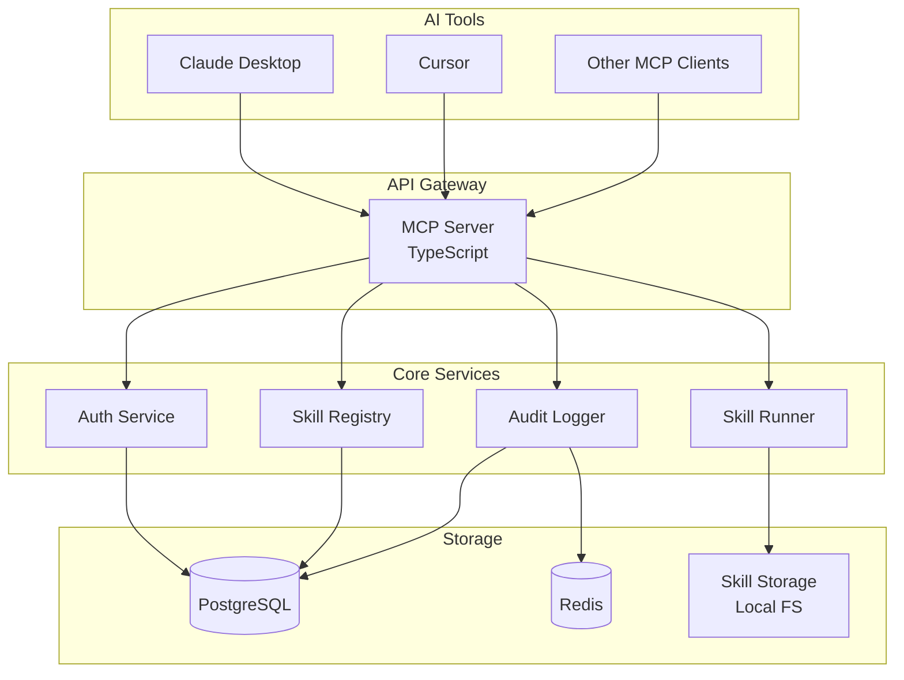
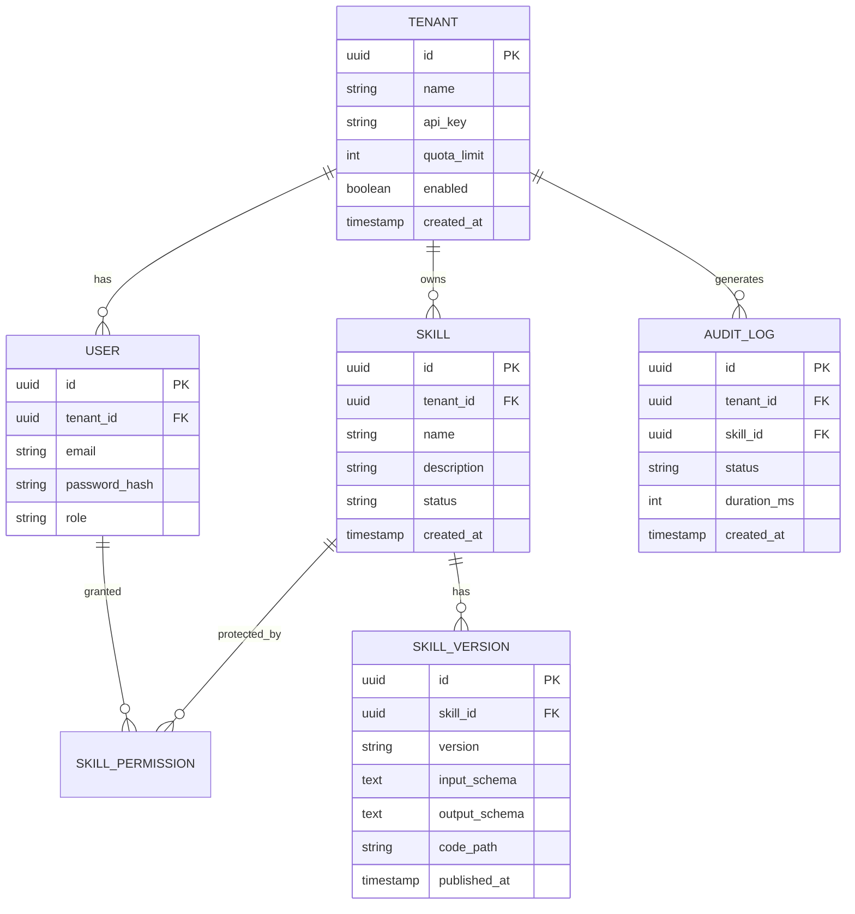

# Skill Management Server

Feature Name: skill-management-server
Updated: 2026-05-28

## Description

本系统是一个基于 MCP 协议的 Skill 管理服务器，支持单组织多团队架构。系统提供 Skill 全生命周期管理、租户权限控制、请求级日志监控能力，使 AI 工具能够动态发现和调用 Skill。

## Architecture



### Architecture Explanation

**MCP Server** 作为统一入口，处理来自 AI 工具的协议请求。它不直接执行业务逻辑，而是委托给内部服务：

- **Auth Service**: 验证 API Key，解析租户上下文，做配额检查
- **Skill Registry**: 管理 Skill 元数据（名称、版本、状态、Schema）
- **Skill Runner**: 动态加载 TypeScript 模块并执行，提供沙箱隔离
- **Audit Logger**: 异步记录调用日志，支持实时指标聚合

数据持久化采用 PostgreSQL 存储结构化数据，Redis 用于配额计数和热点缓存，Skill 代码本体存储在本地文件系统（支持扩展到 S3）。

---

## Components and Interfaces

### 1. MCP Server

```typescript
// mcps/server.ts
export class MCPServer {
  constructor(private auth: AuthService, private registry: SkillRegistry)
  connect(transport: Transport): Promise<void>
  listSkills(tenantId: string): Promise<SkillMeta[]>
  executeSkill(params: { tenantId, skillId, input }): Promise<any>
}
```

**职责**:
- 实现 MCP 协议（Stdio/SSE 传输）
- 请求认证与租户路由
- Skill 发现与调用转发

### 2. Auth Service

```typescript
// services/auth.ts
export class AuthService {
  async validateApiKey(apiKey: string): Promise<Tenant>
  async checkQuota(tenantId: string): Promise<QuotaStatus>
  async decrementQuota(tenantId: string): Promise<void>
}
```

**职责**:
- API Key 验证与租户解析
- 调用配额检查与扣减
- JWT Token 签发（管理端使用）

### 3. Skill Registry

```typescript
// services/registry.ts
export class SkillRegistry {
  async getSkill(skillId: string, version?: string): Promise<Skill>
  async listPublishedSkills(tenantId: string): Promise<SkillMeta[]>
  async publishSkill(skill: Skill): Promise<void>
  async archiveSkill(skillId: string): Promise<void>
}
```

**职责**:
- Skill 元数据 CRUD
- 版本管理（Semantic Versioning）
- 状态机管理（draft → published → archived）

### 4. Skill Runner

```typescript
// services/runner.ts
export class SkillRunner {
  async load(skillPath: string): Promise<SkillModule>
  async execute(module: SkillModule, input: any, options: RuntimeOptions): Promise<any>
}

interface RuntimeOptions {
  timeout: number      // 默认 30000ms
  maxMemory: number    // 默认 512MB
  allowedPermissions: string[]
}
```

**职责**:
- 动态导入 TypeScript 模块
- 执行超时与内存限制
- 权限沙箱（禁用 fs、net 等 Node API）

### 5. Audit Logger

```typescript
// services/logger.ts
export class AuditLogger {
  async log(params: AuditEvent): Promise<void>
  async query(params: QueryParams): Promise<AuditLog[]>
  async getMetrics(tenantId: string, window: string): Promise<Metrics>
}

interface AuditEvent {
  tenantId: string
  skillId: string
  status: 'success' | 'error' | 'timeout'
  duration: number
  timestamp: Date
}
```

**职责**:
- 异步写入调用日志（使用消息队列解耦）
- 实时指标聚合（QPS、P99、错误率）
- 日志导出（CSV 格式）

---

## Data Models



---

## Correctness Properties

### Invariants

1. **租户隔离**: 租户 A 的用户永远无法访问租户 B 的 Skill，即使知道 Skill ID
2. **版本不可变**: 已发布的 Skill 版本内容不可修改，只能通过新版本覆盖
3. **原子配额**: 配额扣减与 Skill 执行必须原子，防止并发超额调用

### Constraints

1. 单个 Skill 代码文件最大 1MB
2. 单个租户最多创建 100 个 Skill
3. 默认 API Key 永不过期（支持管理员手动轮换）
4. 日志保留期最短 7 天，最长 365 天

---

## Error Handling

| Error Type | HTTP Status | MCP Error Code | User Message |
|------------|-------------|----------------|--------------|
| Invalid API Key | 401 | -32001 | "Invalid or expired API key" |
| Skill Not Found | 404 | -32002 | "Skill '{id}' not found or not published" |
| Permission Denied | 403 | -32003 | "No permission to execute skill '{id}'" |
| Quota Exceeded | 429 | -32004 | "Monthly quota exceeded, please upgrade plan" |
| Execution Timeout | 504 | -32005 | "Skill execution timeout after {seconds}s" |
| Execution Error | 500 | -32006 | "Skill execution failed: {error_message}" |
| Invalid Input | 400 | -32007 | "Input validation failed: {validation_errors}" |

**错误处理策略**:
- 所有错误返回结构化 JSON，包含 `code`、`message`、`details` 字段
- 服务端错误记录完整堆栈到 Audit Log，但不对客户端暴露
- MCP 协议错误码遵循 JSON-RPC 2.0 规范（-32700 ~ -32000）

---

## Test Strategy

### Unit Testing

**测试框架**: Jest + ts-jest

**覆盖率要求**:
- 语句覆盖率 ≥ 90%
- 分支覆盖率 ≥ 80%
- 关键路径（Auth、Runner）覆盖率 ≥ 95%

**Mock 策略**:
- 数据库操作使用 `jest.mock()` 模拟
- Skill Runner 使用沙箱隔离测试

### Integration Testing

**测试工具**: Supertest + testcontainers

**测试场景**:
1. 完整 Skill 调用链路（MCP Client → Server → Runner → Response）
2. 多租户并发调用与配额隔离
3. 数据库事务与回滚

### E2E Testing

**测试框架**: Playwright（管理端）+ 自定义 MCP Client

**测试场景**:
1. 租户创建 → Skill 上传 → 发布 → AI 调用 → 日志查看
2. 权限变更 → 验证访问控制生效
3. 配额耗尽 → 验证 429 限流

### Performance Testing

**测试工具**: k6

**性能指标**:
- P99 延迟 < 500ms（不含 Skill 执行时间）
- 单节点支持 ≥ 1000 QPS
- 内存泄漏检测（24 小时压测）

---

## References

[^1]: (MCP Specification) - [Model Context Protocol Docs](https://modelcontextprotocol.io/docs)
[^2]: (TypeScript Sandbox) - [vm2 Module](https://www.npmjs.com/package/vm2)
[^3]: (Quota Limiting) - [Token Bucket Algorithm](https://en.wikipedia.org/wiki/Token_bucket)
